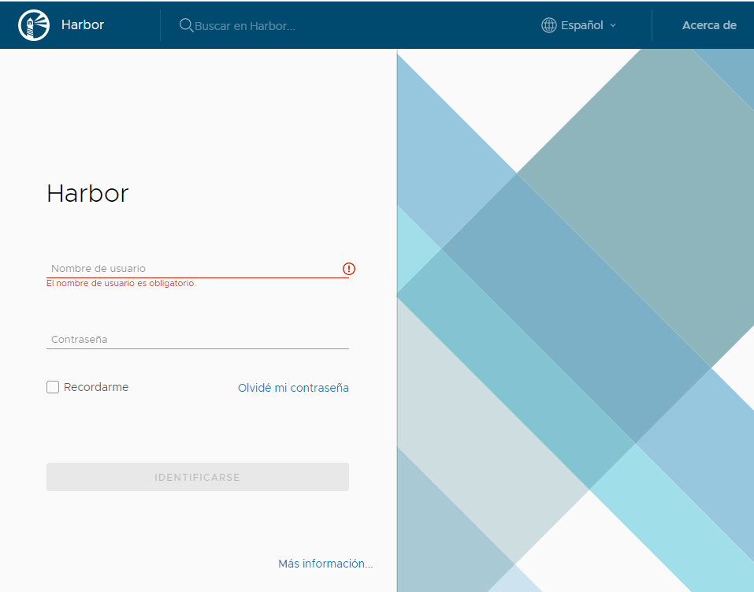

# Como instalar harbor

## Prerequisitos

| Prerequisto | Descripción !
|-------------|-------------|
| Certificado SSL | Crear un certificado SSL con una CA |
| Nombre de dominio | Por ejemplo: registry.container.acme.com |

## Instalar docker

Ejecutar el siguiente script

```sh
sudo yum install -y yum-utils
sudo yum-config-manager \
    --add-repo \
    https://download.docker.com/linux/centos/docker-ce.repo
sudo yum install docker-ce docker-ce-cli containerd.io
sudo systemctl start docker
sudo systemctl enable docker
```

## Instalar nginx

Ejecutar los siguientes comandos:

```sh
sudo yum install -y nginx
sudo systemctl start nginx
sudo systemctl enable nginx
```

## Copiar los archivos del certificado

Copiar los archivos <cert>.crt y <cert>.key a una carpeta accesible

## Instalar wget y tar

```sh
sudo yum install -y web
sudo yum install -y tar
``` 

## Descargar y descomprimir harbor

```sh
cd $HOME 
wget https://github.com/goharbor/harbor/releases/download/v1.10.1/harbor-online-installer-v1.10.1.tgz
tar xvzf harbor-online-installer-v1.10.1.tgz
```

## Configurar harbor

```sh
cd harbor
vi harbor.yml
```

Los parámetros a configurar son:

| Configuración | Parámetro | Descripción |
|---------------|-----------|-------------|
| hostname      |           | nombre del host (p.e. registry.container.acme.com) |
| http          | port      | puerto http para hacer redirecicón https (no usar el 80) |
| https         | certificate | ruta al archivo crt (p.e /home/adminuser/certificate/registrycontainer.crt) |
| https         | private_key | ruta al archivo key (p.e. /hme/adminuser/certificate/registrycontainer.key) |
| harbor_admin_password | | Password del usuario admin |

## Instalar harbor

``` sh
sudo ./install.sh — with-clair
```

## Añadir entrada a archivo /etc/hosts

```sh
sudo vi /etc/hosts
```

Añadir la siguiente línea:
```txt
127.0.0.1 registry. container.acme.com
```

## Probar harbor

Abrir el navegador con la urp https://<ip de la máquina virtual>

Se mostrará la siguiente pantalla:



## Añadir el certificado raiz del certificado SSL en Oracle Linux

1. Copiar el certificado a la máquina de linux (archivo .crt)
2. Copiar el certificado (.crt) a la carpeta /etc/pki/ca-trust/source/anchors/
3. Ejecutar el comando *update-ca-trust*

La máquina ya está lista para usar el registro de imágenes
